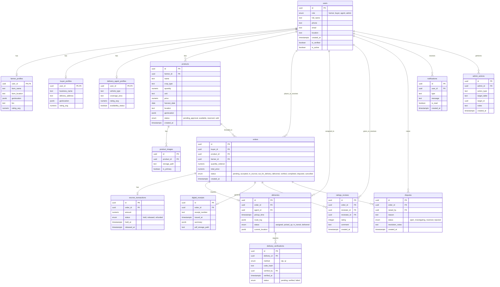

# Database Entity-Relationship Diagram

This diagram represents the PostgreSQL schema implemented in Supabase for the Digital Farmer-Buyer Matching System.

```mermaid
erDiagram
    users {
        uuid id PK
        enum role "farmer, buyer, agent, admin"
        text full_name
        text phone
        text email
        text location
        timestamptz created_at
        boolean is_verified
        boolean is_active
    }
    
    farmer_profiles {
        uuid user_id PK, FK
        text farm_name
        text farm_location
        jsonb geolocation
        text bio
        numeric rating_avg
    }
    
    buyer_profiles {
        uuid user_id PK, FK
        text business_name
        text delivery_address
        jsonb geolocation
        numeric rating_avg
    }
    
    delivery_agent_profiles {
        uuid user_id PK, FK
        text vehicle_type
        text coverage_area
        numeric rating_avg
        boolean availability_status
    }
    
    products {
        uuid id PK
        uuid farmer_id FK
        text name
        text crop_type
        numeric quantity
        text unit
        numeric price
        date harvest_date
        text location
        jsonb geolocation
        enum status "pending_approval, available, reserved, sold"
        timestamptz created_at
    }
    
    product_images {
        uuid id PK
        uuid product_id FK
        text storage_path
        boolean is_primary
    }
    
    orders {
        uuid id PK
        uuid buyer_id FK
        uuid product_id FK
        uuid farmer_id FK
        numeric quantity_ordered
        numeric total_price
        enum status "pending, accepted, in_escrow, out_for_delivery, delivered, verified, completed, disputed, cancelled"
        timestamptz created_at
    }
    
    escrow_transactions {
        uuid id PK
        uuid order_id FK
        numeric amount
        enum status "held, released, refunded"
        timestamptz held_at
        timestamptz released_at
    }
    
    deliveries {
        uuid id PK
        uuid order_id FK
        uuid agent_id FK
        timestamptz pickup_time
        jsonb route_log
        enum status "assigned, picked_up, in_transit, delivered"
        jsonb current_location
    }
    
    delivery_verifications {
        uuid id PK
        uuid delivery_id FK
        enum method "otp, qr"
        text code_hash
        uuid verified_by FK
        timestamptz verified_at
        enum status "pending, verified, failed"
    }
    
    digital_receipts {
        uuid id PK
        uuid order_id FK
        text receipt_number
        timestamptz issued_at
        jsonb summary
        text pdf_storage_path
    }
    
    ratings_reviews {
        uuid id PK
        uuid order_id FK
        uuid reviewer_id FK
        uuid reviewee_id FK
        integer rating
        text comment
        timestamptz created_at
    }
    
    disputes {
        uuid id PK
        uuid order_id FK
        uuid raised_by FK
        text reason
        enum status "open, investigating, resolved, rejected"
        text resolution_notes
        timestamptz created_at
    }
    
    notifications {
        uuid id PK
        uuid user_id FK
        text type
        text message
        boolean is_read
        timestamptz created_at
    }
    
    admin_actions {
        uuid id PK
        uuid admin_id FK
        text action_type
        text target_table
        uuid target_id
        text notes
        timestamptz created_at
    }

    users ||--o| farmer_profiles : has
    users ||--o| buyer_profiles : has
    users ||--o| delivery_agent_profiles : has
    users ||--o{ products : lists
    products ||--o{ product_images : has
    users ||--o{ orders : places_or_receives
    products ||--o{ orders : included_in
    orders ||--o| escrow_transactions : has
    orders ||--o| deliveries : requires
    users ||--o{ deliveries : assigned_to
    deliveries ||--o{ delivery_verifications : requires
    orders ||--o| digital_receipts : generates
    orders ||--o{ ratings_reviews : prompts
    users ||--o{ ratings_reviews : gives_or_receives
    orders ||--o{ disputes : generates
    users ||--o{ disputes : raises
    users ||--o{ notifications : receives
    users ||--o{ admin_actions : performs
```
